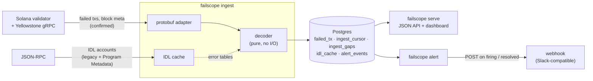

# failscope

> Streams Solana transactions that **failed on-chain**, decodes *why* they failed (including custom Anchor errors inside CPIs, attributed to the program that actually failed), stores them, serves an API and dashboard, and alerts when a program's failure rate spikes.


_Dashboard during a local run: synthetic failures from the companion program (`dev/traffic.sh`), streamed through a local validator's Yellowstone plugin, decoded and stored. [Dark mode](docs/dashboard-dark.png)._

**Status:** M0–M8 done (M8: webhook alerting), plus Docker packaging. **Scope: devnet and a local validator only;** nothing streams from mainnet. The few mainnet transactions in `fixtures/` are static, read-only test data. See [PLAN.md](PLAN.md) for the roadmap and [docs/decisions.md](docs/decisions.md) for every design decision and verified runtime behaviour.

## Failed vs dropped

failscope only sees transactions that **landed in a block** and then failed during execution (the fee was charged, the state changes were rolled back). Transactions that were **dropped** (never landed: expired blockhash, rejected in preflight, lost in forwarding) never reach Geyser, so they are invisible here. This is not a landing-rate tool.

## Architecture



Three processes share one Postgres: `ingest` writes, `serve` and `alert` read. All three are subcommands of one binary.

| Path | What it is |
|---|---|
| `crates/decoder` | Pure decoding: logs + error + account keys → attributed, classified failure. No I/O. |
| `crates/idl` | Fetches Anchor IDLs from both on-chain locations; TTL cache. |
| `crates/ingest` | Yellowstone subscription, protobuf adapter, resume from cursor, gap tracking. |
| `crates/store` | Storage traits and the Postgres implementation (migrations in `crates/store/migrations`). |
| `crates/alert` | Spike detection and webhook delivery. |
| `crates/api` | The `failscope` binary: `ingest`, `serve` (API + dashboard), `alert`. |
| `onchain/` | Separate Anchor workspace: `fail_target` / `fail_callee`, programs that fail on purpose, plus their LiteSVM tests and devnet sender. |
| `fixtures/` | Recorded failed transactions (devnet, mainnet, Yellowstone captures) with hand-verified expected decodes; on-chain IDL accounts. |
| `dev/` | Local validator with the Yellowstone plugin, traffic generator, end-to-end scripts. |

## Decoding pipeline

`crates/decoder` takes a transaction (logs, error, resolved account keys, inner instructions) plus IDL error tables, and does no I/O.

1. **Attribute.** Walk the logs as a stack (`invoke [n]` pushes, `success`/`failed:` pops). The first `failed:` line is the innermost failing program. Outer frames repeat custom codes, but for runtime errors they report a *different* reason, so only the first line is trusted. The result is cross-checked against the top-level program and the recorded inner instructions.
   - Logs truncated or missing, no CPI ran: the top-level program must be the one that failed (`high` confidence).
   - Logs truncated or missing, CPIs ran: the failing program is unknown. The top-level program is kept as a guess with `low` confidence and the error is **not** named, because a code's meaning depends on which program returned it.
2. **Name the error**; first match wins, recorded as `decode_source`:
   1. `anchor_log`: the `AnchorError …` line logged by the failing frame (and only that frame), when its number matches the code.
   2. `native`: System, SPL Token, Token-2022, Associated Token tables, generated from the upstream error enums.
   3. `idl`: the failing program's IDL `errors`.
   4. `anchor_framework`: Anchor's built-in codes (< 6000), only for programs with a known IDL.
   5. `runtime`: non-`Custom` errors, refined by the `failed:` reason (`ProgramPanicked`, `ComputeUnitsExceeded`).
   6. `unknown`: code and program are kept; the name is not.
3. **IDLs** come from `crates/idl`, which reads both on-chain locations in one call: the legacy Anchor IDL account (Anchor < 1.0, most mainnet programs) and the Program Metadata account (Anchor ≥ 1.0), in either IDL format. The cache also remembers "no IDL", and is persisted across restarts.
4. **Derive** `cu_requested` and `priority_fee` with agave 3.1's rules. Tests check that `5000 × signatures + priority_fee` equals the charged fee for every fixture.

## Ingest

Subscribes to failed, non-vote transactions at `confirmed` commitment, plus block meta for `block_time`. A bounded channel gives backpressure. On reconnect it resumes from a slot cursor via `from_slot`, and inserts are idempotent. Slots the server can no longer replay are recorded in `ingest_gaps` rather than skipped silently. Tested end to end against a local validator: hard kill and graceful stop lose nothing (`dev/e2e-resume.sh`), and downtime past the replay window produces a gap covering every lost failure (`dev/e2e-gap.sh`).

## API, dashboard, alerts

- **`failscope serve`**: JSON API ([docs/api.md](docs/api.md)) and the dashboard at `/`, which is plain HTML/JS/SVG compiled into the binary and served with a strict CSP.
- **`failscope alert`**: every minute, compares each program's failures in the last 5 minutes with its own average over the hour before. It fires when the count reaches `max(10, 3 × baseline)`, and resolves below 75% of that threshold, so it doesn't flap. A webhook is POSTed only on state changes, with a Slack-compatible `text` field. A state change is recorded only after the webhook accepts it, so a failed delivery is retried. All thresholds are flags. `dev/e2e-alert.sh` checks quiet → burst → fire → resolve on a live local stream.

## Companion program failure modes

`onchain/` holds two Anchor programs deployed on devnet: `fail_target` (one instruction per failure mode) and `fail_callee` (fails inside a nested CPI). Signatures and explorer links are in [fixtures/README.md](fixtures/README.md).

| # | Failure | Transaction error | Program that actually failed | Decoded as |
|---|---|---|---|---|
| 1 | `require!` user error | `InstructionError(0, Custom(6000))` | fail_target | AlwaysFails (`anchor_log`) |
| 2 | `has_one` constraint | `InstructionError(0, Custom(2001))` | fail_target | ConstraintHasOne (`anchor_log`) |
| 3 | missing signer | `InstructionError(0, Custom(3010))` | fail_target | AccountNotSigner (`anchor_log`) |
| 4a | unchecked overflow (panic) | `InstructionError(0, ProgramFailedToComplete)` | fail_target | ProgramPanicked (`runtime`) |
| 4b | checked overflow | `InstructionError(0, Custom(6001))` | fail_target | CheckedOverflow (`anchor_log`) |
| 5 | compute exhaustion | `InstructionError(1, ProgramFailedToComplete)` | fail_target | ComputeUnitsExceeded (`runtime`) |
| 6 | CPI to System with bad transfer | `InstructionError(0, Custom(1))` | System program | ResultWithNegativeLamports (`native`) |
| 7 | nested CPI, callee error | `InstructionError(0, Custom(6000))` | fail_callee | CalleeAlwaysFails (`anchor_log`) |
| 8 | CPI to SPL Token, empty account | `InstructionError(1, Custom(1))` | SPL Token | InsufficientFunds (`native`) |

Rows 1 and 7 share the exact same transaction error, rows 6 and 8 share code 1 from different programs, and rows 4a and 5 share the same variant. Telling them apart is the decoder's job.

## Decoder coverage

On the 13 hand-verified fixtures (`cargo run -p failscope-decoder --example decode_fixtures`): anchor_log 5, runtime 4, native 2, idl 1, unknown 1. The unknown one is a mainnet program with no IDL that logs nothing.

On a 12-minute local run of `dev/traffic.sh` (140 failures through validator → Yellowstone → decode → Postgres): anchor_log 110, runtime 24, native 6, unknown 0. That traffic comes only from the companion programs, so it exercises the pipeline rather than measuring real-world coverage.

Streaming devnet itself needs a hosted devnet Yellowstone endpoint, since the public devnet RPC has no gRPC. Switching only changes `YELLOWSTONE_ENDPOINT` (see [dev/README.md](dev/README.md)).

## Development

Requirements: Rust (toolchains pinned per workspace by `rust-toolchain.toml`), Docker for Postgres, and for `onchain/` the Solana CLI and Anchor CLI 1.2. Local stack setup, including building the Yellowstone plugin: [dev/README.md](dev/README.md).

```sh
cp .env.example .env
docker compose up -d db                 # Postgres
dev/localnet.sh                         # local validator + Yellowstone gRPC
cargo run -p failscope-api -- ingest
cargo run -p failscope-api -- serve     # dashboard + API on http://127.0.0.1:8080
ALERT_WEBHOOK_URL=… cargo run -p failscope-api -- alert
dev/traffic.sh 10                       # optional: 10 min of synthetic failures

# or run ingest + serve (+ alert) in Docker instead of cargo run:
docker compose --profile app up -d --build                     # dashboard on http://127.0.0.1:8080
docker compose --profile app --profile alert up -d --build     # needs ALERT_WEBHOOK_URL in .env

# off-chain workspace (DATABASE_URL enables the Postgres tests)
cargo fmt --all --check
cargo clippy --all-targets -- -D warnings
cargo test

# on-chain workspace
cd onchain
anchor build --arch v0   # SBPF v0; tests load target/deploy/*.so
cargo test               # LiteSVM: runs every failure case locally
cargo run -p fail_client --bin send_failures   # devnet by default; writes fixtures/signatures.json
```

## What I learned

- **The top-level error lies about who failed.** `InstructionError(0, Custom(6000))` came from `fail_target` in one fixture and from `fail_callee`, two CPI levels down, in another. On mainnet, a Jupiter route failed with code 8 from a silent inner program. Without walking the log stack, both get blamed on the wrong program and decoded with the wrong program's error table.
- **Running out of compute is not `ComputationalBudgetExceeded`.** It's `ProgramFailedToComplete`, the same variant as a panic. Only the `failed:` log line tells them apart, and only the innermost one: outer frames say just "Program failed to complete".
- **Logs are a hint, not a record.** They can be truncated or missing. The honest answer when they are, and CPIs ran, is "unknown, low confidence", not a confident guess. Naming an error against a guessed program produced wrong-but-plausible names in testing.
- **Jupiter's slippage error has no readable log line.** Only its on-chain IDL names code 6001. IDL format and IDL location turned out to be independent: Jupiter keeps a new-format IDL in the old location, and Anchor 1.2's own CLI only looks in the new one, so it couldn't fetch it.
- **Streaming is mostly about the unhappy path.** The interesting code is resume, idempotency and gap accounting. Yellowstone reports its oldest replayable slot as `u64::MAX` until it first prunes, and reading that as "no replay" produced a bogus gap. Killing the client on purpose found it.
- **Toolchain details matter.** Anchor 1.2 builds SBPF v3 by default, which LiteSVM couldn't load. The Yellowstone plugin has to be built against the validator's exact Agave version.
