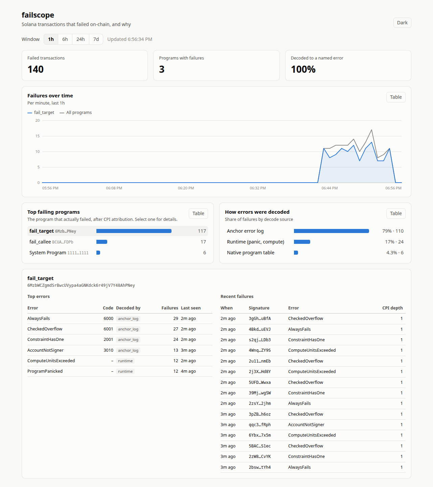

# failscope

> Streams Solana transactions that **failed on-chain**, decodes *why* they failed (including custom Anchor errors inside CPIs, attributed to the program that actually failed), stores them, and serves an API and dashboard.



_Dashboard during a local run: synthetic failures from the companion program (`dev/traffic.sh`), streamed through a local validator's Yellowstone plugin, decoded and stored. A real-traffic run comes with a hosted endpoint. [Dark mode](docs/dashboard-dark.png)._

**Status:** M7 done (dashboard). Next: one stretch goal from PLAN M8. See [PLAN.md](PLAN.md) for the roadmap.

## Failed vs dropped

failscope only sees transactions that **landed in a block** and then failed during execution (the fee was charged, the state changes were rolled back). Transactions that were **dropped** (never landed: expired blockhash, rejected in preflight, lost in forwarding) never reach Geyser, so they are invisible here. This is not a landing-rate tool.

## Architecture

_Diagram coming with M5._

```
Yellowstone gRPC ──> ingest ──> decoder ──> store (Postgres) ──> api + dashboard
                                   │
                                   └── idl (on-chain Anchor IDL fetch + cache)
```

| Path | What it is |
|---|---|
| `crates/decoder` | Pure decoding: logs + error + account keys → attributed, classified failure. No I/O. |
| `crates/idl` | Fetches and caches Anchor IDLs from chain. |
| `crates/ingest` | Yellowstone gRPC subscription, reconnect/resume. |
| `crates/store` | `Store` trait + Postgres implementation. |
| `crates/api` | `failscope` binary: HTTP API and dashboard. |
| `onchain/` | Separate Anchor workspace: `fail_target`, a program that fails on purpose in distinct ways. |
| `fixtures/` | Recorded failed transactions with expected decode results. |
| `docs/decisions.md` | Design decisions and verified spec details. |

## Decoding pipeline

`crates/decoder` is pure: it takes a transaction (logs, error, resolved account keys, inner instructions) and IDL error tables, and does no I/O.

1. **Attribute.** Walk the logs as a stack (`invoke [n]` pushes, `success`/`failed:` pops). The first `failed:` line is the innermost failing program. Outer frames repeat custom codes, but for runtime errors they report a *different* reason, so only the first line is trusted. Cross-check the result against the top-level program and the recorded inner instructions.
   - Logs truncated or missing, and no CPI ran: the top-level program must be the one that failed (`high` confidence).
   - Logs truncated or missing, and CPIs ran: the failing program is unknown. The decoder records the top-level program as a guess with `low` confidence and does **not** name the error, because a code's meaning depends on which program returned it.
2. **Name the error**; first match wins, and the winner is recorded as `decode_source`:
   1. `anchor_log`: the `AnchorError …` line logged by the failing frame (and only that frame), when its number matches the code.
   2. `native`: System, SPL Token, Token-2022, Associated Token tables, generated from the upstream error enums.
   3. `idl`: the failing program's IDL `errors`.
   4. `anchor_framework`: Anchor's built-in codes (< 6000), only for programs with a known IDL. Other programs may use those numbers for something else.
   5. `runtime`: non-`Custom` errors, refined by the `failed:` reason (`ProgramPanicked`, `ComputeUnitsExceeded`).
   6. `unknown`: code and program are kept; the name is not.
3. **IDLs** come from `crates/idl`, which reads both on-chain locations in one RPC call: the legacy Anchor IDL account (Anchor < 1.0, most mainnet programs) and the Program Metadata account (Anchor ≥ 1.0). Both IDL formats are handled. A TTL cache, which also caches "no IDL", feeds the decoder.
4. **Ingest** (`crates/ingest`) subscribes to failed, non-vote transactions at `confirmed` commitment, plus block meta for `block_time`. A bounded channel gives backpressure. On reconnect it resumes from a slot cursor via `from_slot`; slots the server can no longer replay are recorded in `ingest_gaps` instead of being silently skipped. Both directions were tested against a local validator: hard kill, graceful stop, and exceeding the replay window (`dev/e2e-*.sh`).
5. **API and dashboard** (`failscope serve`): top failing programs, top errors per program, failures over time, decode coverage, and failure lookup ([docs/api.md](docs/api.md)). The dashboard at `/` is plain HTML/JS/SVG compiled into the binary, served with a strict CSP.
6. **Derive** `cu_requested` and `priority_fee` from compute-budget instructions using agave 3.1's rules. Tests check that `5000 × signatures + priority_fee` equals the charged fee for every fixture.

## Companion program failure modes

`onchain/` holds two Anchor programs deployed on devnet: `fail_target` (one instruction per failure mode) and `fail_callee` (fails inside a nested CPI). Signatures and explorer links are in [fixtures/README.md](fixtures/README.md).

| # | Failure | Transaction error | Program that actually failed | Decoded as |
|---|---|---|---|---|
| 1 | `require!` user error | `InstructionError(0, Custom(6000))` | fail_target | AlwaysFails (`anchor_log`) |
| 2 | `has_one` constraint | `InstructionError(0, Custom(2001))` | fail_target | ConstraintHasOne (`anchor_log`) |
| 3 | missing signer | `InstructionError(0, Custom(3010))` | fail_target | AccountNotSigner (`anchor_log`) |
| 4a | unchecked overflow (panic) | `InstructionError(0, ProgramFailedToComplete)` | fail_target | ProgramPanicked (`runtime`) |
| 4b | checked overflow | `InstructionError(0, Custom(6001))` | fail_target | CheckedOverflow (`anchor_log`) |
| 5 | compute exhaustion | `InstructionError(1, ProgramFailedToComplete)` | fail_target | ComputeUnitsExceeded (`runtime`) |
| 6 | CPI to System with bad transfer | `InstructionError(0, Custom(1))` | System program | ResultWithNegativeLamports (`native`) |
| 7 | nested CPI, callee error | `InstructionError(0, Custom(6000))` | fail_callee | CalleeAlwaysFails (`anchor_log`) |

Rows 1 and 7 share the exact same transaction error, and rows 4a and 5 share the same variant. Telling them apart is the decoder's job.

## Decoder coverage

_Numbers from a real stream come after M5._ On the 12 fixtures (`cargo run -p failscope-decoder --example decode_fixtures`): anchor_log 5, runtime 4, idl 1, native 1, unknown 1. The unknown one is a mainnet program with no IDL that logs nothing.

## Development

Requirements: Rust (toolchains are pinned per workspace by `rust-toolchain.toml`), and for `onchain/` the Solana CLI and Anchor CLI 1.2.

Local stack (validator with the Yellowstone plugin, Postgres): see [dev/README.md](dev/README.md).

```sh
cp .env.example .env
docker compose up -d db          # Postgres
dev/localnet.sh                  # local validator + Yellowstone gRPC
cargo run -p failscope-api -- ingest
cargo run -p failscope-api -- serve   # dashboard + API on http://127.0.0.1:8080
dev/traffic.sh 10                     # optional: 10 min of synthetic failures

# off-chain workspace
cargo fmt --all --check
cargo clippy --all-targets -- -D warnings
cargo test
cargo run          # starts the failscope binary

# on-chain workspace
cd onchain
anchor build --arch v0   # SBPF v0; tests load target/deploy/*.so
cargo test               # LiteSVM: runs every failure case locally
cargo run -p fail_client --bin send_failures   # devnet only; writes fixtures/signatures.json
```

## What I learned

_Written as the project goes._
